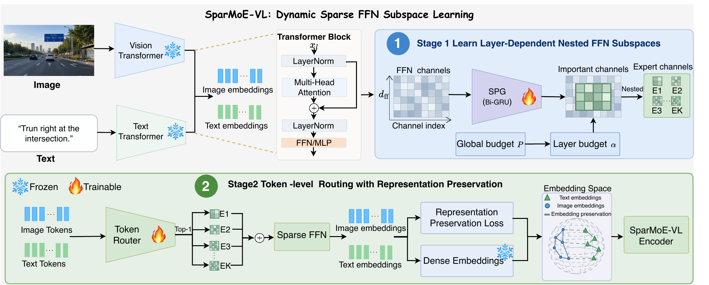

# SparMoE-VL

Shared implementation and experiment archive for **SparMoE-VL:
Alignment-Preserving Sparse Feed-Forward Subspace Learning for Contrastive
Vision-Language Encoders**.

SparMoE-VL converts frozen vision-language FFNs into nested sparse subspaces
and learns token-conditioned capacity selection while preserving the
pretrained cross-modal representation geometry. The repository includes the
documented experiment workflows without committing generated metrics or
figures.

## Repository status

This repository is shared as a research software and reproducibility resource.
It contains source code, experiment launchers, documentation, and protocol
metadata. Generated metrics, figures, manuscripts, and private review
materials are intentionally omitted.

This work has been submitted to *Neural Networks* and is shared for
reproducible research; please do not republish the same work or results as an
independent submission, as doing so may constitute duplicate publication or
copyright infringement, while code reuse remains governed by the MIT License.

Use, modification, and redistribution are governed by the MIT License in
`LICENSE`. When reusing the implementation or comparing against the included
baselines, please acknowledge this repository and the upstream methods,
models, and datasets listed in `THIRD_PARTY.md`.

## Overview



[Open the original overview PDF](docs/over.pdf)

## Highlights

- Two-stage sparse conversion for the vision and text towers of CLIP ViT-L/14.
- Exact ordered 500,000-sample training-pool validation between both stages.
- TEAL, OPTIN, FLAP, and MoPE comparisons for both modalities.
- Transfer to CLIP, SigLIP, SigLIP2, and LLaVA-v1.5-7B.
- Reproducible ablations, interventions, and mechanism visualizations.
- Installable Python package and CPU protocol tests.

## Repository layout

```text
SparMoE-VL/
├── src/sparmoe_vl/       # Reusable models, training, evaluation, and metrics
├── configs/              # Main-experiment configurations
├── experiments/          # Thin entry points grouped by experimental question
│   ├── sparmoe_vl_clip_vitl14/
│   ├── clip_vitl14_text_ffn_baselines/
│   ├── clip_vitl14_vision_ffn_baselines/
│   ├── architecture_transfer/
│   ├── downstream/
│   └── figures/
├── checkpoints/          # Tracked layout only; binary weights are Git-ignored
├── docs/                 # Data, reproduction, and experiment documentation
├── tests/                # CPU unit and protocol tests
├── pyproject.toml
└── environment.yml       # Reference NVIDIA/CUDA environment
```

Experiment directories contain readable launchers and immutable protocol
configuration. Shared implementations live under `src/` so experiments do
not silently diverge through copied training code.

## Installation

Python 3.10 or newer is supported. A platform-native PyTorch installation is
recommended before installing the project.

```bash
python -m venv .venv
source .venv/bin/activate
python -m pip install --upgrade pip
python -m pip install -e ".[analysis]"
```

Install the LLaVA extras only when reproducing the downstream transfer study:

```bash
python -m pip install -e ".[analysis,llava]"
```

For the pinned Linux/NVIDIA setup used for the reference experiments:

```bash
conda env create -f environment.yml
conda activate sparmoe-vl
python -m pip install -e .
```

The reference environment uses Python 3.10.20, PyTorch 2.5.1 with CUDA 12.1,
and OpenCLIP 3.3.0. Unit tests and metadata checks run on CPU; full training
and feature extraction are intended for CUDA accelerators.

## Data and path configuration

Datasets and pretrained models are not redistributed. By default, the code
looks for them in the parent directory of the checkout. Any checkout name or
storage layout can be used through two environment variables:

```bash
export SPARMOE_VL_ROOT=/path/to/SparMoE-VL
export SPARMOE_VL_WORKSPACE=/path/to/external-assets
```

`SPARMOE_VL_ROOT` contains this repository and generated `outputs/`.
`SPARMOE_VL_WORKSPACE` contains `models/`, `ShareGPT4V/`, and `data/eval/`.
Every data/model/output path can also be overridden at the individual command
line. See [data layout](docs/data_layout.md) for the complete tree.

## Quick start

Run one CLIP ViT-L/14 visual seed from the repository root:

```bash
python experiments/sparmoe_vl_clip_vitl14/vision/train_stage1.py \
  --seed 42 \
  --output-dir outputs/main/vision/seed_42/stage1

python experiments/sparmoe_vl_clip_vitl14/vision/train_stage2.py \
  --seed 42 \
  --stage1-checkpoint outputs/main/vision/seed_42/stage1/best.pt \
  --output-dir outputs/main/vision/seed_42/stage2

python experiments/sparmoe_vl_clip_vitl14/vision/evaluate.py \
  --checkpoint outputs/main/vision/seed_42/stage2/best.pt
```

Stage 2 verifies the model, modality, training seed, data seed, target budget,
sample count, and ordered dataset SHA-256 stored by Stage 1. It aborts before
training if the data identity differs. Stage 1 trains only the SPG structure
and layer capacities under the global budget. Stage 2 initializes from and
freezes that complete structure, then optimizes only the token routers within
the inherited budget-bounded expert space. Replace `vision` with `text` for the
text-tower experiment, or run `run_three_seeds.sh` for seeds 42, 123, and
2026.

## Reference experiments

| Experiment area | Experiment directory |
|---|---|
| Main method and baselines | `experiments/sparmoe_vl_clip_vitl14`, `clip_vitl14_*_ffn_baselines` |
| Visual budget study | `experiments/sparmoe_vl_clip_vitl14/studies/vision_budget_sweep` |
| Cross-dataset generalization | `experiments/sparmoe_vl_clip_vitl14/studies/cross_dataset_generalization` |
| LLaVA transfer | `experiments/downstream/llava_transfer` |
| Architecture transfer | `experiments/architecture_transfer` |
| Capacity intervention | `experiments/sparmoe_vl_clip_vitl14/studies/capacity_intervention` |
| Component ablation | `experiments/sparmoe_vl_clip_vitl14/studies/component_ablation` |
| Mechanism figures | `experiments/figures` |

Use the [reproduction guide](docs/reproduction.md) for the run order and the
[experiment index](docs/experiment_index.md) for the exact data,
checkpoint, seed, and protocol mapping of every table and figure.

## Outputs and checkpoints

All new checkpoints, logs, metrics, caches, and rendered plots are written to
`outputs/`, which is ignored by Git. No measured result values are embedded in
the source tree.

Optional pretrained SparMoE-VL weights can be placed under `checkpoints/`
using the documented [checkpoint layout](checkpoints/README.md). Weight files
remain outside Git and should be distributed through model hosting or GitHub
release assets. The full workflow can also be reproduced by training from the
pretrained backbone.

## Development checks

```bash
python -m pip install -e ".[analysis,dev]"
ruff format --check .
ruff check .
pytest
```

The tests validate model contracts, immutable experiment settings, checkpoint
transitions, data identities, metric aggregation, and plotting inputs without
requiring the full datasets or GPUs.

## Citation

For repository citation metadata, see [`CITATION.cff`](CITATION.cff). GitHub
exposes it through the **Cite this repository** action.

## License

SparMoE-VL is released under the [MIT License](LICENSE). External models,
datasets, and baseline methods are subject to their respective terms; see
[THIRD_PARTY.md](THIRD_PARTY.md) for source and license information.

See [CONTRIBUTING.md](CONTRIBUTING.md) for development and reporting guidance.
